<div align="center">

<!-- ═══════════════════════════════════════════════════════════════ -->
<!--                    ANIMATED HERO BANNER                         -->
<!-- ═══════════════════════════════════════════════════════════════ -->


<br/>

<!-- ═══════════════════════════════════════════════════════════════ -->
<!--              ANIMATED TYPING TITLE  (width=900 fix)             -->
<!-- ═══════════════════════════════════════════════════════════════ -->

[](https://github.com/Sundaranandhan15)

<br/>

<!-- ═══════════════════════════════════════════════════════════════ -->
<!--                      CATCHY QUOTE                               -->
<!-- ═══════════════════════════════════════════════════════════════ -->

> ### *"Data is the new oil — but I'm the one who builds the refinery."* ⚡
> *— Every AI/ML Student Who Actually Ships Things*

<br/>

<!-- ═══════════════════════════════════════════════════════════════ -->
<!--               SOCIAL LINKS — DESIGNED BADGES                    -->
<!-- ═══════════════════════════════════════════════════════════════ -->

[](https://www.linkedin.com/in/sundaranandhan-r-j-42b300314/)
[](https://github.com/Sundaranandhan15)
[](mailto:rjsundar15cr7@gmail.com)
[](mailto:rjsundar15cr7@gmail.com)

<br/>


</div>

---

<!-- ═══════════════════════════════════════════════════════════════ -->
<!--                       ABOUT ME                                  -->
<!-- ═══════════════════════════════════════════════════════════════ -->

## 🧠 About Me


```python
#!/usr/bin/env python3
# ┌─────────────────────────────────────────────┐
# │        sundaranandhan.profile               │
# │        >>> Loading developer...  ✓          │
# └─────────────────────────────────────────────┘

class Sundaranandhan:

    def __init__(self):
        self.name        = "Sundaranandhan R J"
        self.degree      = "B.Tech CSE (AI & ML) — 2027"
        self.university  = "SRM Institute of Science & Technology"
        self.location    = "Tamil Nadu, India 🇮🇳"
        self.email       = "rjsundar15cr7@gmail.com"
        self.experience  = "Ex ML Intern @ NIT Trichy"
        self.role        = "Aspiring AI/ML Engineer & Python Dev"
        self.currently   = "Building. Breaking. Learning. Repeating."
        self.fun_fact    = "I think in tensors before I think in words"

    def passions(self):
        return [
            "🤖  Training models that actually work in prod",
            "🔭  Exploring LLMs & Generative AI frontiers",
            "🏗️  Building full-stack AI-powered systems",
            "📖  Cracking placements while crushing projects",
            "☕  Converting caffeine → clean Python code",
        ]

    def life_equation(self):
        return "Hard Work + ML + Curiosity = 🚀 Dream Job"


me = Sundaranandhan()
print(f"Hello World! I'm {me.name}")
print(f"Status: {me.currently}")
# OUTPUT → Hello World! I'm Sundaranandhan R J
# OUTPUT → Status: Building. Breaking. Learning. Repeating.
```

<br clear="right"/>

---

## ⚙️ What I Do

<div align="center">

| 🔨 I Build | 🧠 I Learn | 🎯 I Target |
|:---:|:---:|:---:|
| Full-Stack AI Applications | Machine Learning & Deep Learning | Placement-Ready ML Engineer Role |
| End-to-End ML Pipelines | LLMs, GenAI & RAG Systems | Top-Tier AI Product Companies |
| REST APIs with FastAPI | Data Structures & Algorithms | Building a Portfolio That Speaks |
| Dockerized Production Systems | OS, CN, DBMS — Core CS Fundamentals | Open Source Contributions |
| Real-World Problem Solvers | PyTorch, Model Optimization | Research & Innovation in AI |

</div>

<br/>

```
🧩  DAILY LOOP                          🎯  CURRENT FOCUS
━━━━━━━━━━━━━━━━━━━━━━━━━━━━         ━━━━━━━━━━━━━━━━━━━━━━━━━━━
  Wake up                              ✅  Placement Prep (DSA + CS)
  → Plan what to build today           ✅  GenAI Project Development
  → Code for 4+ hours                  ✅  ML Research & Paper Reading
  → Debug everything 😅               ✅  Open Source Contributions
  → Learn something new                ✅  Internship/Job Applications
  → Push to GitHub                     ✅  SRMIST Final Year Projects
  → Sleep (optional)
  → Repeat
```

---

## 🛠️ Tech Stack

### 💻 Languages & Core CS


### 🤖 AI / ML / DL


### 🌐 Backend & APIs


### 🗄️ Databases & CS Fundamentals


### ☁️ DevOps & Tools


---

## 🚀 Featured Projects

<div align="center">

| 🌱 Project | 📝 Description | 🛠️ Stack |
|:---|:---|:---|
| [**🌾 AgroV — Multimodal GenAI Farmer Training**](https://github.com/Sundaranandhan15/-AgroV-Multimodal-GenAI-Farmer-Training-Ecosystem) | GenAI-powered multimodal ecosystem for farmer training & crop advisory | LLM · GenAI · Multimodal · Python |
| [**🗺️ GIS Route Optimization System**](https://github.com/Sundaranandhan15/GIS-Route-Optimization-System) | Geospatial intelligence system for intelligent route planning & optimization | GIS · Python · Optimization · Maps |
| [**⚙️ Machine Health Monitoring Node**](https://github.com/Sundaranandhan15/Machine-Health-Monitoring-Node) | Real-time industrial machine health monitoring using ML anomaly detection | IoT · ML · FastAPI · Real-time |
| [**📄 ResumeIQ**](https://github.com/Sundaranandhan15/ResumeIQ) | AI-powered resume analyzer and enhancer for smarter job applications | NLP · LLM · FastAPI · Python |
| [**🎓 EduAI Platform**](https://github.com/Sundaranandhan15/Eduai-Platform) | Full-stack adaptive learning platform with Deep Knowledge Tracing & NVIDIA Triton | DKT · Triton · React · Docker |

</div>

---

## 📊 GitHub Stats

<div align="center">

<!-- Streak stats — demolab (most reliable) -->


<br/><br/>

<!-- Trophies — completely different provider, always works -->


<br/><br/>

<!-- Activity graph -->


</div>

---

## 🎮 Play My Signature Game — Neuron Rush 🧠

> **Not your ordinary snake game.** You are a signal firing through a neural network — collect data packets, dodge loss spikes, grab activation bursts! A game only an AI/ML developer would ship. ⚡

**🕹️ To play:** Download `neuron-rush.html` from this repo → Open it in your browser → Game on!

[](https://github.com/Sundaranandhan15/Sundaranandhan15/raw/main/neuron-rush.html)
[](https://github.com/Sundaranandhan15/Sundaranandhan15/blob/main/neuron-rush.html)

---

## 🐍 Contribution Activity

<div align="center">

<picture>
  <source media="(prefers-color-scheme: dark)" srcset="https://raw.githubusercontent.com/Sundaranandhan15/Sundaranandhan15/output/github-snake-dark.svg"/>
  <source media="(prefers-color-scheme: light)" srcset="https://raw.githubusercontent.com/Sundaranandhan15/Sundaranandhan15/output/github-snake.svg"/>
  
</picture>

</div>

---

<div align="center">



<br/>

[](https://github.com/Sundaranandhan15)

<br/>

*Made with ❤️, ☕ and way too many `git commits` by **Sundaranandhan R J***

</div>
